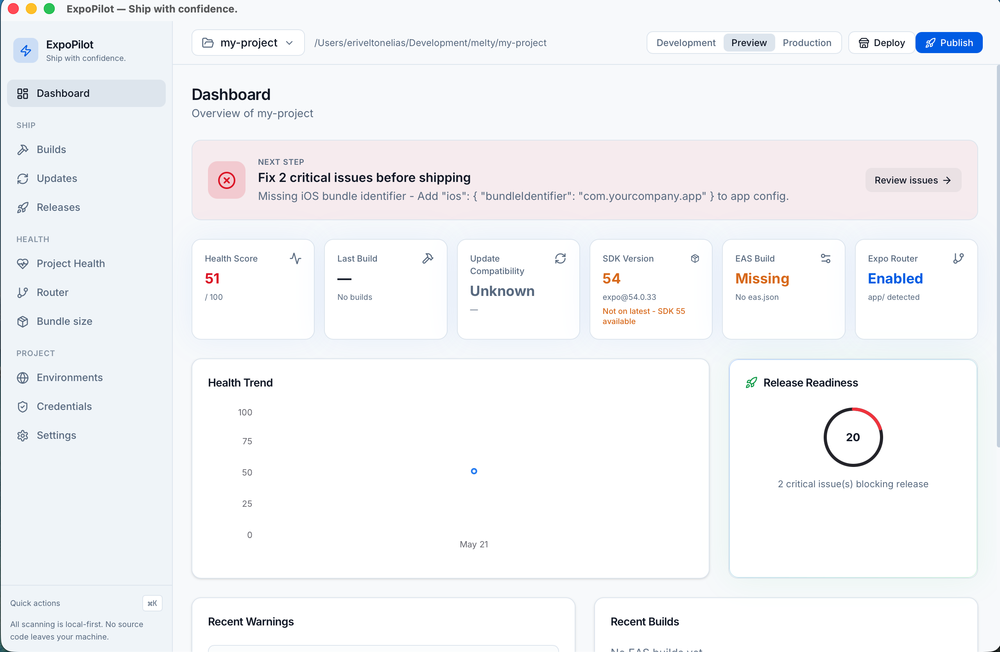

# Hangar

**Ship with confidence.**

Hangar is a desktop control center for Expo projects. It scans your codebase locally, surfaces configuration problems, run EAS builds and review update failures, inspects credentials and bundle size, and walks you through release preparation - all without uploading your source anywhere.

If you've ever shipped an Expo app and felt the dread of "did I configure everything right?", this is built for you.

---



## Table of Contents

- [Features](#features)
- [Download](#download)
- [Requirements](#requirements)
- [Getting Started](#getting-started)
- [Project Structure](#project-structure)
- [Architecture Overview](#architecture-overview)
- [Development Workflow](#development-workflow)
- [Privacy](#privacy)
- [Troubleshooting](#troubleshooting)
- [Contributing](#contributing)

---

## Features

- **Project health scanner** - detects missing `app.json`/`app.config.*`, broken `eas.json`, outdated SDK, misconfigured Expo Router, missing icons, and ~20 other rules.
- **Expo Doctor integration** - runs `npx expo-doctor` and parses results into actionable issues.
- **EAS builds dashboard** - list recent builds, view logs, and get plain-English explanations for common build failures.
- **Updates inspector** - view EAS Update channels/branches and check runtime-version compatibility against builds.
- **Release readiness** - checklist + score before publishing to App Store / Play Store, including a deploy command generator.
- **Bundle size analysis** - categorize a built bundle (JS, images, fonts, media), track size deltas over time, find your heaviest files.
- **Credentials health** - surface expiring iOS provisioning profiles, keystores, and certificates before they break a build.
- **Router map** - visualize Expo Router file-based routes, deep-link schemes, and route warnings.
- **Multi-project switcher** - register multiple Expo projects and jump between them.
- **CLI** - same scanner engine usable from the terminal for CI or quick checks.

## Download

Pre-built installers for every release are published on the [**Releases page**](https://github.com/eriveltonelias/hangar/releases). Grab the file for your OS, install, and you're done - no toolchain required to just *use* the app.

| Platform | File to download | Notes |
| --- | --- | --- |
| **macOS (Apple Silicon)** | `Hangar_<version>_aarch64.dmg` | Open the `.dmg`, drag Hangar to Applications. |
| **macOS (Intel)** | `Hangar_<version>_x64.dmg` | Same as above. |
| **Windows 10/11 (x64)** | `Hangar_<version>_x64-setup.exe` or `.msi` | Either works; the `.exe` is a smaller NSIS installer. |
| **Linux (Debian / Ubuntu)** | `hangar_<version>_amd64.deb` | `sudo dpkg -i hangar_*.deb` |
| **Linux (Fedora / RHEL)** | `hangar-<version>-1.x86_64.rpm` | `sudo rpm -i hangar-*.rpm` |
| **Linux (any distro)** | `hangar_<version>_amd64.AppImage` | `chmod +x` then double-click. |

The latest release is always at [`/releases/latest`](https://github.com/eriveltonelias/hangar/releases/latest). If you want to stay on the bleeding edge or help test, check the "Pre-release" entries.

**Unsigned binaries.** Until code signing is in place, first launch will show a Gatekeeper warning on macOS and a SmartScreen warning on Windows.

- **macOS:** right-click the app → **Open** → **Open** in the dialog. Or, from the terminal: `xattr -dr com.apple.quarantine /Applications/Hangar.app`.
- **Windows:** click **More info** → **Run anyway** in the SmartScreen popup.

Prefer to build from source? See [Getting Started](#getting-started) below.

## Requirements

- **Node.js** 20+
- **pnpm** 9+ (this repo pins via `packageManager`)
- **Rust** (required - the app runs natively via Tauri)
- **Expo CLI / EAS CLI** in your `PATH` for the features that shell out (`npx expo-doctor`, `eas build:list`, etc.)

### Install Rust (required for `pnpm dev`)

```bash
curl --proto '=https' --tlsv1.2 -sSf https://sh.rustup.rs | sh
source "$HOME/.cargo/env"   # add cargo to PATH in current shell
cargo --version             # should print 1.x
```

Add the source line to your `~/.zshrc` or `~/.bashrc` so new terminals pick up Rust automatically.

## Getting Started

```bash
# 1. Clone and install
git clone <repo-url>
cd hangar
pnpm install

# 2. Run the desktop app (Tauri - first run compiles Rust, ~1–2 min)
pnpm dev

```

On first launch the app will ask you to register an Expo project directory - pick the root folder that contains `package.json` and `app.json` / `app.config.*`.


## Project Structure

```
hangar/
├── apps/
│   └── desktop/              # Tauri v2 + React 19 + Vite + Tailwind 4
│       ├── src/
│       │   ├── screens/      # Top-level routed screens
│       │   ├── components/   # Reusable feature components
│       │   ├── lib/          # Services, store (zustand), platform shims
│       │   └── routes/       # AppRouter
│       └── src-tauri/        # Rust side (commands, capabilities)
├── packages/
│   ├── core/                 # Pure TS scanner engine - no I/O imports
│   │   └── src/
│   │       ├── scanners/     # project, router, doctor, expo-config, build-log
│   │       ├── rules/        # ~20 health-check rules
│   │       ├── eas/          # parsers, deploy/build/submit logic
│   │       ├── bundle/       # bundle size categorization
│   │       ├── credentials/  # provisioning expiry analysis
│   │       ├── adapters/     # FileSystemAdapter (node impl)
│   │       └── types/        # Shared TS types
│   ├── cli/                  # commander + chalk CLI on top of @hangar/core
│   └── ui/                   # Shared component library (Tailwind + CVA)
├── pnpm-workspace.yaml
└── tsconfig.base.json
```

## Architecture Overview

- **`@hangar/core` is I/O-agnostic.** Scanners take a `FileSystemAdapter` so the same code runs in Node (CLI), Tauri (desktop), or memory (tests).
- **Desktop app talks to the OS via Tauri.** Shelling out to `expo`, `eas`, reading files, watching folders - all goes through Tauri commands on the Rust side. The React app stays a normal Vite SPA.
- **State lives in zustand.** See `apps/desktop/src/lib/store` for the slices (projects, scan, ui, onboarding, toasts).
- **Public APIs are explicit.** `packages/core/src/index.ts` and `packages/core/src/node.ts` are the only entry points; everything else is internal.

## Development Workflow

```bash
pnpm dev                       # desktop (Tauri)
pnpm --filter @hangar/core dev   # rebuild core in watch mode

pnpm typecheck                 # all packages
pnpm test                      # run vitest in every package that has tests
pnpm build                     # production build of every package
pnpm build:core                # core only
pnpm build:desktop             # desktop only

pnpm cli scan ../my-expo-app   # quick exercise of the scanner
```

Useful conventions:

- Anything that touches the disk lives in `apps/desktop/src/lib/*-service.ts` or `packages/core/src/adapters/*`. Keep scanners pure.
- New scan rules go in `packages/core/src/rules/index.ts` and get registered in `ALL_SCAN_RULES`.
- New screens get routed via `apps/desktop/src/routes/AppRouter.tsx`.

## Testing

The core scanner engine is covered by [Vitest](https://vitest.dev). Tests live next to the source as `*.test.ts` files inside `packages/core/src`.

```bash
pnpm test                              # run every package's tests
pnpm --filter @hangar/core test     # core only
pnpm --filter @hangar/core test:watch
```

What's covered today:

- `bundle/categorize` - extension → category mapping, byte formatting, report aggregation, delta thresholds.
- `credentials/expiry` - day math, status cliffs, EAS-managed detection, worst-status rollup.
- `expo-sdk` - version parsing and latest-SDK detection.
- `utils/helpers` - health-score arithmetic, issue id sequencing, path helpers, staging-URL detection.
- `eas/parsers` - EAS CLI JSON tolerance, `relativeTime` formatter.
- `eas/deploy-readiness` - deploy command + store label generation.
- `scanners/router-links` - navigable-route classification, deep link / example path / query helpers.

When changing any of those modules, run `pnpm --filter @hangar/core test:watch` for fast feedback. New behaviour should land with a test that fails without the change.

## Privacy

All project scanning is **local-first**. No source code, file paths, or scan results are uploaded to any external service. EAS-related commands talk directly to your local `eas` CLI, which uses your existing Expo credentials. Hangar has no telemetry endpoint.

## Troubleshooting

**`pnpm dev` fails with "port 1420 already in use"**
```bash
lsof -ti :1420 | xargs kill -9
```

**Rust toolchain missing**
Re-run the Rust install command above, then `source "$HOME/.cargo/env"` in the same shell where you run `pnpm dev`.

**`eas` / `expo` commands fail inside the app**
Verify they work from your shell first (`eas --version`, `npx expo --version`). The app inherits your `PATH` - if you installed them via `nvm` or `volta`, make sure your login shell exports them.

**Typecheck passes but the app shows stale types**
Rebuild core: `pnpm build:core`. The desktop app consumes the built `dist/` output for type definitions.

---

## Contributing

Contributions are welcome - bug reports, scan rules, screen improvements, and docs all help.

### Ground rules

- **Be kind.** Assume good intent. We want this to be a low-friction project to contribute to.
- **Open an issue first for non-trivial changes.** A 10-line bugfix doesn't need a design discussion; a new screen or a new scan category does. This saves you from a rebase later.
- **Keep PRs focused.** One feature or one fix per PR. If you find drive-by cleanups along the way, put them in a follow-up PR so review stays fast.

### Development setup

```bash
git clone <repo-url>
cd hangar
pnpm install
pnpm typecheck        # sanity check
pnpm dev              # launches the Tauri desktop app
```

You should be able to launch the app, scan an Expo project on your machine, and see results within ~30 seconds.

### Branching & commits

- Branch from `main` using a descriptive name: `fix/router-deeplink-encoding`, `feat/bundle-history-chart`, `docs/contributing-guide`.
- Write commit messages in the imperative mood: `add credentials expiry rule`, not `added` or `adding`.
- Squash noisy WIP commits before opening the PR.

### Coding standards

- **TypeScript everywhere.** Avoid `any`; prefer narrow types and `unknown` at boundaries.
- **`@hangar/core` stays pure.** No `node:fs`, no Tauri imports, no React. Anything that touches the disk goes behind a `FileSystemAdapter` or moves to `core/node.ts`.
- **Tailwind for styling.** Reuse the components in `packages/ui` before creating new ones. If you need a new primitive, add it to `packages/ui/src/components` and export it from `packages/ui/src/index.ts`.
- **Run `pnpm typecheck` before pushing.** CI will run it too, but local feedback is faster.
- **No dead code.** Don't merge unused exports, files, or imports - strip them in the same PR.

### Adding a new scan rule

1. Add a function to `packages/core/src/rules/index.ts` that takes a `ScanContext` and returns `Issue[]`.
2. Register it in the `ALL_SCAN_RULES` array.
3. Add a sample fixture in your PR description showing the rule firing on a real project.

### Adding a new screen

1. Create `apps/desktop/src/screens/MyScreen.tsx`.
2. Register the route in `apps/desktop/src/routes/AppRouter.tsx`.
3. Add a nav entry in `apps/desktop/src/components/layout/AppShell.tsx`.
4. Pull state from the zustand store (`apps/desktop/src/lib/store`) rather than fetching ad hoc.

### Pull request checklist

Before requesting review, make sure:

- [ ] `pnpm typecheck` passes.
- [ ] `pnpm build` succeeds (`build:core` and `build:desktop` at minimum).
- [ ] You manually exercised the change against a real Expo project.
- [ ] The PR description includes: motivation, what changed, how to test, and screenshots/GIFs for UI changes.
- [ ] No secrets or absolute local paths are committed.
- [ ] No unused imports, exports, or files were introduced.

### Reporting bugs

When opening an issue, please include:

- Hangar version (or commit SHA) and OS.
- Node, pnpm, and (if relevant) Rust versions.
- The Expo SDK version of the project you were scanning.
- Steps to reproduce, expected vs. actual behavior.
- Any console / terminal output. Redact paths and identifiers as needed.

### Proposing features

Open a GitHub issue with the **feature request** label and describe:

- The problem you're trying to solve (not just the solution).
- Who else might benefit.
- A rough sketch of UX or API, if you have one.

---
